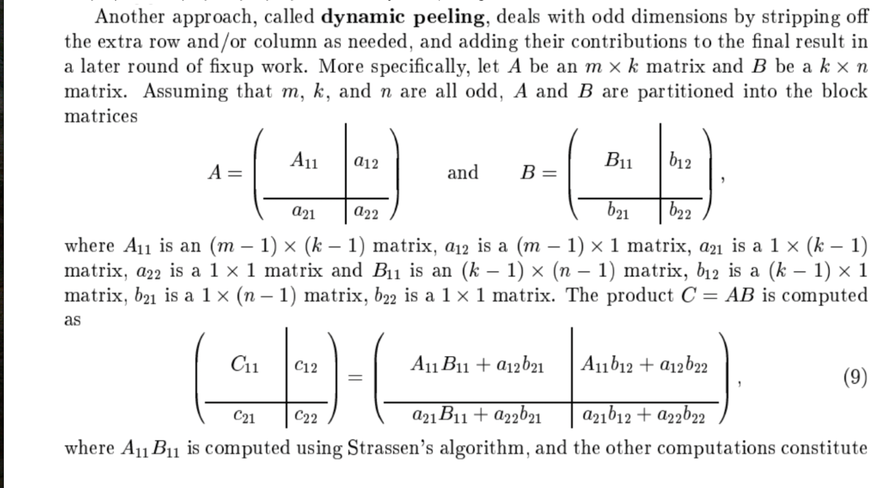
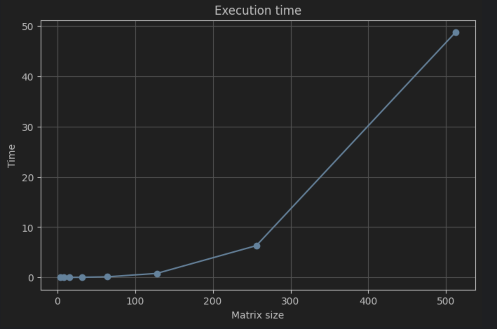
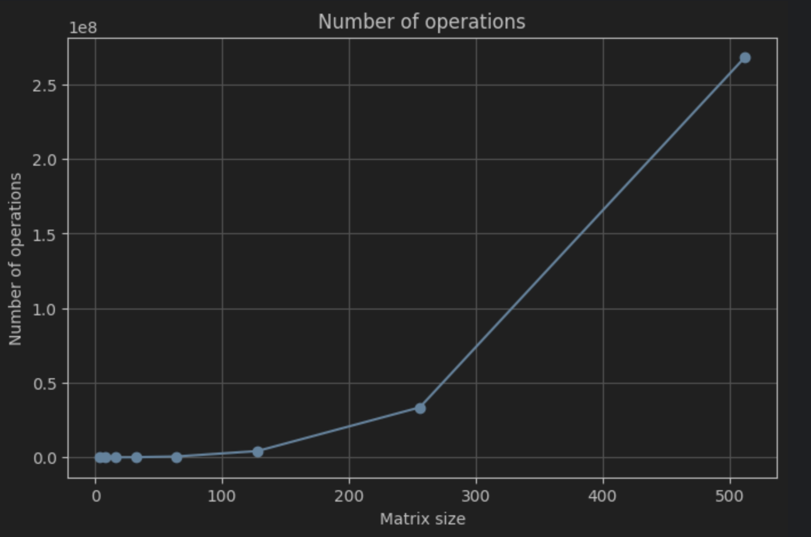
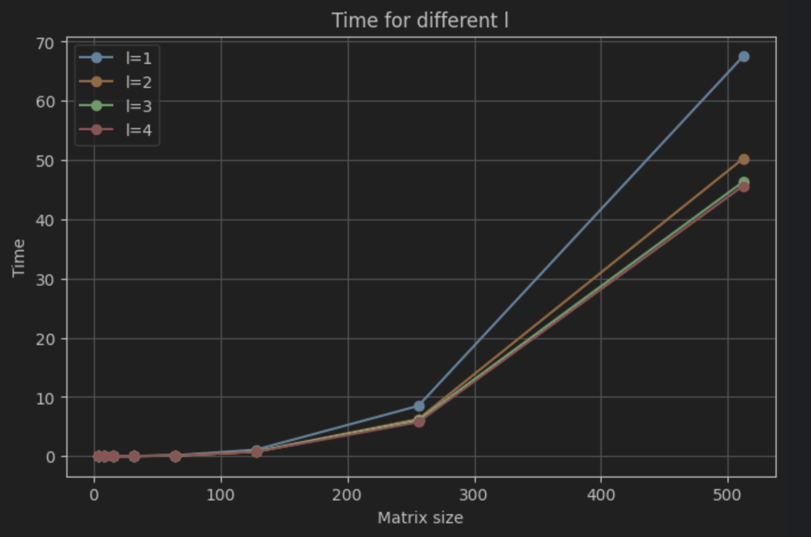
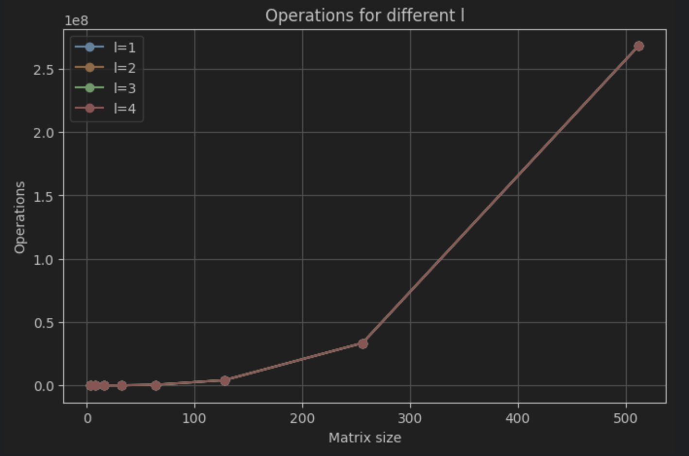

# Rachunek Macierzowy 
## Projekt 1
Natalia Bratek, Joanna Konieczny 

1. Treść projektu 

Dla macierzy o rozmiarze mniejszym lub równym 2^l × 2^l algorytm tradycyjny. Dla macierzy o rozmiarze większym od
2^l × 2^l algorytm rekurencyjny Binéta.

2. Opis 

Chcemy wyznaczyć macierz C, będącą iloczynem macierzy A i B, czyli C = A ׁᐧ B. 
Algorytm Binet’a polega na rozbiciu macierzy na mniejsze bloki, a następnie mnożeniu tych bloków i sumowaniu  
ich zgodnie z zasadami mnożenia macierzy. Po wykonaniu obliczeń dla wszystkich bloków, wyniki są łączone w macierz C. 
Implementacja algorytmu Bineta została rozszerzona tak, aby działała również dla macierzy o dowolnych wymiarach, 
a nie tylko dla rozmiarów będących potęgą liczby 2.
W przypadku nieparzystych wymiarów stosowany jest mechanizm dynamic peeling, który polega na odseparowaniu 
dodatkowego wiersza lub kolumny i uwzględnieniu ich wkładu w końcowym wyniku.
Dodatkowo dla macierzy prostokątnych stosowane jest rozszerzenie macierzy do rozmiaru kwadratowego poprzez
dopełnienie zerami, a po obliczeniach wynik jest przycinany do oryginalnych wymiarów.




3. Pseudokod 

        binet(A, B, l)
            Jeśli rozmiar macierzy (n) ≤ 2^l
                wykonaj tradycyjne_mnożenie_macierzy(A, B)
            Jeśli rozmiar macierzy A jest nieparzysty
                wykonaj podział macierzy A i B na podmacierze dynamiczne A11, A12, A21, A22 oraz B11, B12, B21, B22 o rozmiarach (n-1) x (n-1), (n-1) x 1, 1 x (n-1), 1 x 1 odpowiednio, gdzie n to rozmiar macierzy A i B
                oblicz pomocnicze macierze:
                    C11 = binet(A11, B11) + tradycyjne_mnożenie_macierzy(A12, B21)
                    C12 = tradycyjne_mnożenie_macierzy(A11, B12) + tradycyjne_mnożenie_macierzy(A12, B22)
                    C21 = tradycyjne_mnożenie_macierzy(A21, B11) + tradycyjne_mnożenie_macierzy(A22, B21)
                    C22 = tradycyjne_mnożenie_macierzy(A21, B12) + tradycyjne_mnożenie_macierzy(A22, B22)
                zwróć połączone macierze C11, C12, C21, C22

			W przeciwnym przypadku (n jest parzyste): 
				wykonaj podział macierzy A i B na równe 4 bloki: A11, A12, A21, A22 oraz B11, B12, B21, B22

				oblicz pomocnicze macierze:
				C11 = binet(A11, B11) + binet(A12, B21) 
				C12 = binet(A11, B12) + binet(A12, B22) 
				C21 = binet(A21, B11) + binet(A22, B21) 
				C22 = binet(A21, B12) + binet(A22, B22) 

				zwróć połączone bloki (C11, C12, C21, C22)

4. Fragment kodu
```python

        def __binet(self, A, B):
        n = len(A)
        if n <= 2 ** self.l:
            return self.calc.traditional_matrix_multiplication(A, B)

        if n % 2 == 1:
            A11, A12, A21, A22 = self.calc.split_into_block_matrices_dynamic_peeling(A)
            B11, B12, B21, B22 = self.calc.split_into_block_matrices_dynamic_peeling(B)

            C11 = self.calc.add(self.__binet(A11, B11), self.calc.traditional_matrix_multiplication(A12, B21))
            C12 = self.calc.add(self.calc.traditional_matrix_multiplication(A11, B12), self.calc.traditional_matrix_multiplication(A12, B22))
            C21 = self.calc.add(self.calc.traditional_matrix_multiplication(A21, B11), self.calc.traditional_matrix_multiplication(A22, B21))
            C22 = self.calc.add(self.calc.traditional_matrix_multiplication(A21, B12), self.calc.traditional_matrix_multiplication(A22, B22))

            return self.calc.connect_block_matrices_dynamic_peeling(C11, C12, C21, C22)
        else:
            A11, A12, A21, A22 = self.calc.split_into_block_matrices(A)
            B11, B12, B21, B22 = self.calc.split_into_block_matrices(B)

            C11 = self.calc.add(self.__binet(A11, B11), self.__binet(A12, B21))
            C12 = self.calc.add(self.__binet(A11, B12), self.__binet(A12, B22))
            C21 = self.calc.add(self.__binet(A21, B11), self.__binet(A22, B21))
            C22 = self.calc.add(self.__binet(A21, B12), self.__binet(A22, B22))

            return self.calc.connect_block_matrices(C11, C12, C21, C22)

```
4. Wyniki 









