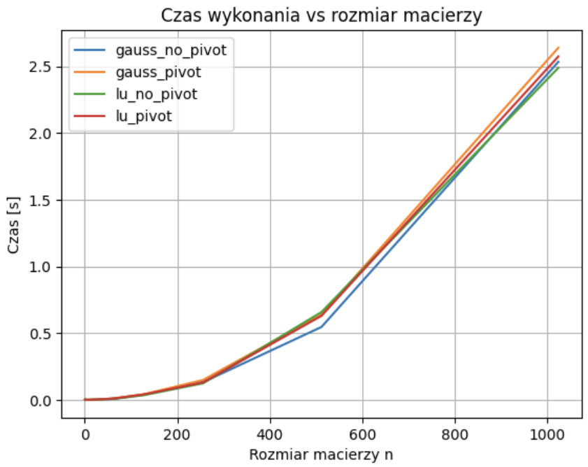
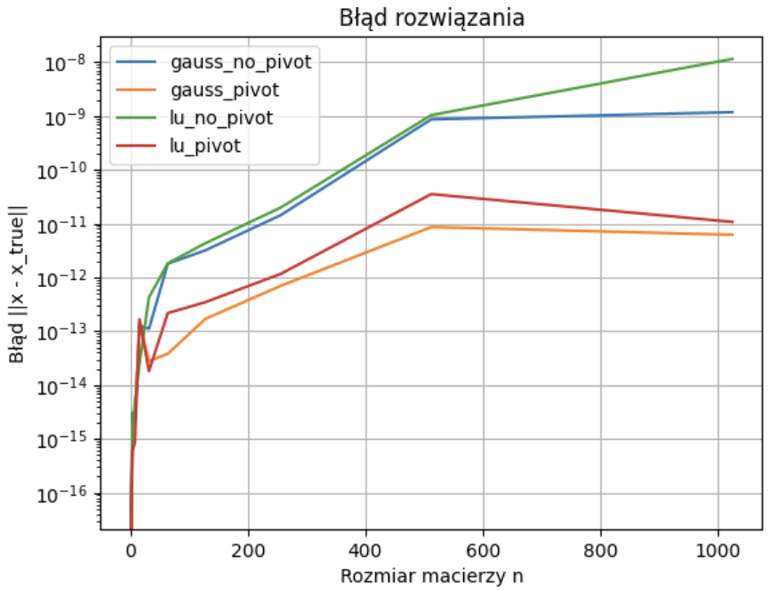

# Rachunek Macierzowy - Projekt 2

> Natalia Bratek, Joanna Konieczny

## Treść zadania

W ramach zadania zaimplementowano algorytmy:

- eliminacji Gaussa bez pivotingu generujący jedynki na przekątnej,
- eliminacji Gaussa z pivotingiem,
- LU faktoryzacji bez pivotingu,
- LU faktoryzacji z pivotingiem.

Dla powyższych algorytmów zmierzono czasy wykonania i rząd błędu w zależności od rozmiaru macierzy oraz zweryfikowano poprawność za pomocą macierzy o rozmiarach $17 \times 17$ oraz $24 \times 24$.

## Opis

### Algorytm eliminacji Gaussa

Algorytm eliminacji Gaussa jest podstawowym i najpopularniejszym
algorytmem rozwiązywania układów równań liniowych. Korzysta on z poniższych własności układów równań:

- Układ równań będzie równoważny, jeśli wybrany wiersz przemnożymy przez stałą różną od zera.

-  Układ równań będzie równoważny, jeśli wybrany wiersz dodamy lub odejmiemy od innego wiersza.

Sama metoda eliminacji Gaussa polega na sprowadzeniu macierzy współczynników do postaci trójkątnej górnej.

### Algorytm LU faktoryzacji

Algorytm LU faktoryzacji jest metodą rozwiązywania układów równań liniowych. której nazwa pochodzi od użytych w tej metodzie macierzy trójkątnych, tj. dolnotrójkątnej (dolnej) i górnotrójkątnej (górnej). Metoda pozwala także na szybkie wyliczenie wyznacznika macierzy układu.

Głównymi zaletami tej metody jest duża oszczędność pamięci (zwłaszcza przy wprowadzeniu nowej prawej strony) i małą wymagana liczba operacji w porównaniu z innymi metodami.

### Pivoting

Pivoting to kluczowy mechanizm stabilizacji numerycznej w algorytmach. Polega on na zamianie wierszy tak, aby jako pivot (element główny) wybrać element największy co do wartości bezwzględnej w danej kolumnie.

Można wyróżnić 2 rodzaje pivotingu:

- pivoting częściowy, polegający na zamianie wierszy,
- pivoting pełny, polegający na zamianie zarówno wierszy, jak i kolumn.

W ramach projektu zaimplementowano algorytmy z pivotingiem częściowym.

## Pseudokod

Poniżej przedstawiono pseudokody zaimplementowanych funkcji.

### Algorytm eliminacji Gaussa bez pivotingu 

```
A - macierz współczynników
b - wektor wynikowy

gauss_no_pivot(A, b):
    n <- liczba wierszy A
    Dla k = 1 do n:
        pivot <- A[k,k]
        Dla j = k do n:
            A[k,j] <- A[k,j] / pivot
        b[k] <- b[k] / pivot

        Dla i = k+1 do n:
            factor <- A[i,k]
            Dla j = k do n:
                A[i,j] <- A[i,j] - factor * A[k,j]
            b[i] <- b[i] - factor * b[k]

    Dla i = n do 1:
    x[i] <- b[i]
    Dla j = i+1 do n:
        x[i] <- x[i] - A[i,j]*x[j]
    
    Zwróć x
```

### Algorytm eliminacji Gaussa z pivotingiem

```
A - macierz współczynników
b - wektor wynikowy

gauss_partial_pivot(A, b):
    n <- liczba wierszy A
    Dla k = 1 do n:
        max_row <- indeks i, dla którego |A[i,k]| jest największe
        
        Zamień wiersze A[k,*] z A[max_row,*]

        Zamień b[k] z b[max_row]

        Dla i = k+1 do n:
            factor <- A[i,k] / A[k,k]
            Dla j = k do n:
                A[i,j] <- A[i,j] - factor * A[k,j]
            b[i] <- b[i] - factor * b[k]

    Dla i = n do 1:
    x[i] <- b[i]
    Dla j = i+1 do n:
        x[i] <- x[i] - A[i,j]*x[j]
    
    Zwróć x
```

### Algorytm LU faktoryzacji bez pivotingu

```
lu_no_pivot(A):
    U <- A
    L <- I
    n <- liczba wierszy A

    Dla k = 1 do n:
        Dla i = k+1 do n:
            factor <- U[i,k] / U[k,k]
            L[i,k] <- factor

            Dla j = k do n:
                U[i,j] <- U[i,j] - factor * U[k,j]
    Zwróć L, U
```

### Algorytm LU faktoryzacji z pivotingiem

```
lu_partial_pivot(A):
    U <- A
    L <- I
    P <-I
    n <- liczba wierszy A

    Dla k = 1 do n:
        max_row <- indeks i, dla którego |U[i,k]| jest największe
        
        Zamień wiersze U[k,*] z U[max_row,*]

        Zamień wiersze P[k,*] z P[max_row,*]

        Jeżeli k > 1:
            Zamień wiersze L[k,1:k-1] z L[max_row,1:k-1]
        
        Dla i = k+1 do n:
            factor <- U[i,k] / U[k,k]
            L[i,k] <- factor

    Zwróć P, L, U
```

## Fragmenty kodu

Poniżej znajdują się algorytmy bazowane na powyższych pseudokodach, zaimplementowane w języku Python z wykorzystaniem biblioteki `numpy`.

### Algorytm eliminacji Gaussa bez pivotingu 

```python
def gauss_no_pivot_unit_diag(A, b):
    n = A.shape[0]
    A = A.astype(float)
    b = b.astype(float)

    for k in range(n):
        pivot = A[k, k]
        
        A[k, :] = A[k, :] / pivot
        b[k] = b[k] / pivot

        for i in range(k + 1, n):
            factor = A[i, k]
            A[i, :] -= factor * A[k, :]
            b[i] -= factor * b[k]

    x = np.zeros(n)
    for i in reversed(range(n)):
        x[i] = b[i] - np.dot(A[i, i+1:], x[i+1:])

    return x
```

### Algorytm eliminacji Gaussa z pivotingiem

```python
def gauss_partial_pivot(A, b):
    n = A.shape[0]
    A = A.astype(float)
    b = b.astype(float)

    for k in range(n):
        max_row = np.argmax(abs(A[k:, k])) + k

        if max_row != k:
            A[[k, max_row]] = A[[max_row, k]]
            b[[k, max_row]] = b[[max_row, k]]

        for i in range(k + 1, n):
            factor = A[i, k] / A[k, k]
            A[i, :] -= factor * A[k, :]
            b[i] -= factor * b[k]

    x = np.zeros(n)
    for i in reversed(range(n)):
        x[i] = (b[i] - np.dot(A[i, i+1:], x[i+1:])) / A[i, i]

    return x
```

### Algorytm LU faktoryzacji bez pivotingu

```python
def lu_no_pivot(A):
    n = A.shape[0]
    A = A.astype(float)

    L = np.eye(n)
    U = A.copy()

    for k in range(n):
        for i in range(k + 1, n):
            factor = U[i, k] / U[k, k]
            L[i, k] = factor
            U[i, :] -= factor * U[k, :]

    return L, U
```

### Algorytm LU faktoryzacji z pivotingiem

```python
def lu_partial_pivot(A):
    n = A.shape[0]
    A = A.astype(float)

    P = np.eye(n)
    L = np.eye(n)
    U = A.copy()

    for k in range(n):
        max_row = np.argmax(abs(U[k:, k])) + k

        if max_row != k:
            U[[k, max_row]] = U[[max_row, k]]
            P[[k, max_row]] = P[[max_row, k]]

            if k > 0:
                L[[k, max_row], :k] = L[[max_row, k], :k]

        for i in range(k + 1, n):
            factor = U[i, k] / U[k, k]
            L[i, k] = factor
            U[i, :] -= factor * U[k, :]

    return P, L, U
```

## Wyniki

### Porównanie wartości dla macierzy o rozmiarach $17 \times 17$ oraz $24 \times 24$.

Dla obu rozmiarów macierzy porównano wyniki algorytmów z wynikiem rzeczywistym oraz zmierzono średni czas i błąd dla 100 wywołań algorytmów.

#### Wyniki dla macierzy $17 \times 17$

| Algorytm | Średni czas wykonania | Średni błąd |
| --- | --- | --- | 
| Gauss bez pivotingu | `0.0006 s` | `5.386e-13` |
| Gauss z pivotingiem | `0.0009 s` | `5.541e-14` |
| LU bez pivotingu | `0.0007 s` | `4.759e-13` |
| LU z pivotingiem | `0.0015 s` | `6.476e-14` |

#### Wyniki dla macierzy $24 \times 24$

| Algorytm | Średni czas wykonania | Średni błąd |
| --- | --- | --- | 
| Gauss bez pivotingu | `0.0018 s` | `1.435e-12` |
| Gauss z pivotingiem | `0.0015 s` | `4.122e-14` |
| LU bez pivotingu | `0.0011 s` | `2.993e-12` |
| LU z pivotingiem | `0.0019 s` | `5.083e-14` |

### Wykresy





## Wnioski

1. Metody z pivotingiem wykazują większą stabilność numeryczną niż metody bez pivotingu.
2. Algorytmy bez pivotingu są szybsze w sensie operacyjnym, ale mogą prowadzić do dużych błędów.
3. Wszystkie analizowane metody mają złożoność obliczeniową rzędu $O(n^3)$, co potwierdzają wyniki czasowe.
4. W praktyce obliczeń numerycznych pivoting jest standardem, ponieważ znacząco zwiększa niezawodność algorytmów przy niewielkim koszcie dodatkowym.


