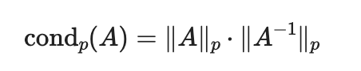
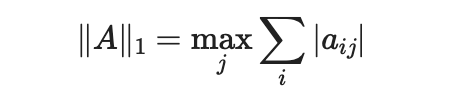
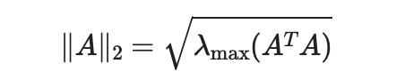
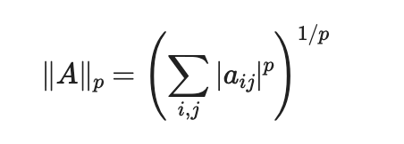
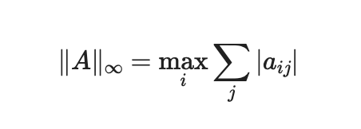
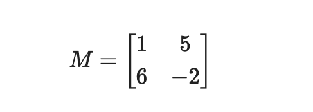

# Rachunek Macierzowy - Projekt 3

> Natalia Bratek, Joanna Konieczny

## Treść zadania

Proszę w wybranym języku programowania napisać program który:

- Oblicza normę macierzową ∥M∥1
- Oblicza współczynnik uwarunkowania macierzowy ∥M∥1
- Oblicza normę macierzową ∥M∥2
- Oblicza współczynnik uwarunkowania macierzowy ∥M∥2
- Oblicza normę macierzową ∥M∥p
- Oblicza współczynnik uwarunkowania macierzowy ∥M∥p
- Oblicza normę macierzową ∥M∥∞
- Oblicza współczynnik uwarunkowania macierzowy ∥M∥∞

## Wstęp
**Norma macierzowa** to funkcja przypisująca macierzy nieujemną liczbę rzeczywistą, określającą jej „wielkość” lub „długość”.
Jest ona naturalnym uogólnieniem normy wektorowej.

Norma macierzowa spełnia następujące własności:
- dodatniość: ||A|| >= 0 oraz ||A|| = 0 wtedy i tylko wtedy, gdy A = 0,
- jednorodność: ||αA|| = |α| * ||A||,
- podaddytywność (nierówność trójkąta): ||A + B|| <= ||A|| + ||B||,
- submultiplikatywność: ||AB|| <= ||A|| * ||B||

Ostatnia własność oznacza, że norma iloczynu macierzy nie przekracza iloczynu ich norm.

**Współczynnik uwarunkowania macierzy** określa, w jakim stopniu błąd reprezentacji numerycznej danych wejściowych danego problemu wpływa na błąd wyniku. 
Małe wartości współczynnika uwarunkowania oznaczają, że układ jest dobrze uwarunkowany.

## 1. Współczynnik uwarunkowania 
- wzór:

<p align="center">
  
</p>

Współczynnik uwarunkowania macierzy ma tę samą definicję dla dowolnej normy.


- implementacja:

```python
def condition_number(matrix_norm, M):
    if np.linalg.det(M) == 0:
        return float('inf')
    M_inv = inv(M)
    return matrix_norm(M) * matrix_norm(M_inv)
```


## 2. Norma macierzowa  ∥M∥1

- wzór:
<p align="center">
  
</p>


- implementacja 
```python
def matrix_norm_1(M):
    return np.max(np.sum(np.abs(M), axis=0))
```

## 3. Norma macierzowa  ∥M∥2
- wzór:
<p align="center">
  
</p>


- implementacja 
```python
def matrix_norm_2(M):
    matrix = M.T @ M
    eigenvalues = np.linalg.eigvals(matrix)
    return np.sqrt(max(eigenvalues))
```


## 3. Norma macierzowa ∥M∥p

- wzór:

<p align="center">
  
</p>


- implementacja 
```python

def matrix_norm_p(M, p):
    return (sum(abs(M[i][j])**p for i in range(len(M)) for j in range(len(M[0])))) ** (1/p)
```

### 4. Norma macierzowa ∥M∥inf
- wzór


<p align="center">
  
</p>


- implementacja 
```python
def matrix_norm_inf(M):
    return max(np.sum(np.abs((M)), axis=1))
```


## 5. Wyniki dla macierzy
Do testów wykorzystano losowo wygenerowaną macierz $M$.  
Dla tej macierzy obliczono wartości norm oraz współczynnika uwarunkowania przy użyciu własnej implementacji
oraz funkcji wbudowanych biblioteki NumPy(np.linalg.norm() oraz np.linalg.cond()).
<p align="center">
  
</p>


```text
zaimplementowana norma 1: 7
numpy norma 1: 7.0

zaimplementowana norma 2: 6.4079839066822375
numpy norma 2: 6.4079839066822375

zaimplementowana norma inf: 8
numpy norma inf: 8.0

zaimplementowana norma p: 8.12403840463596
numpy norma p: 8.12403840463596

współczynnik uwarunkowania: 1.2831955546343297
numpy współczynnik uwarunkowania: 1.2831955546343299
```

## Wnioski

Zaimplementowane funkcje poprawnie obliczają normy macierzowe oraz współczynnik uwarunkowania. 
