# Rachunek Macierzowy
# Projekt 5

> Natalia Bratek, Joanna Konieczny

---

# Treść zadania

## 1. Implementacja metody potęgowej dla macierzy 3×3

Proszę w wybranym języku programowania zaimplementować metodę potęgową dla macierzy 3×3.

Algorytm powinien spełniać następujące założenia:

### a) Losowanie wektora początkowego

Losujemy wektor początkowy: z⁰ o współrzędnych z przedziału otwartego: (0,1)

---

### b) Obliczenie błędu początkowego

Obliczamy: w⁰ = A z⁰

następnie liczymy błąd:

error = || A z⁰ − maxᵢ(wᵢ⁰) z⁰ ||ₚ

Jeśli: error < 10⁻⁸ wówczas wracamy do punktu b)
(czyli nie startujemy z wektora, który spełnia warunek stopu).

---

### c) Iteracja

Ustalamy:

- epsilon,
- normę ||·||ₚ

i wykonujemy iteracje algorytmu.

---

## 2. Obliczenie SVD dla losowej macierzy 3×3

Proszę wylosować macierz: A ∈ ℝ³ˣ³ oraz policzyć: SVD = UDV w następujący sposób.

---

### a) Wyznaczenie macierzy U oraz D

Należy obliczyć:

- wartości własne,
- wektory własne

macierzy AAᵀ

Z tego obliczenia otrzymujemy macierze U oraz D

---

### b) Wyznaczenie macierzy V

Macierz V obliczamy ze wzoru:

V = Aᵀ U inv(D)

gdzie odwrotność macierzy diagonalnej liczona jest elementowo:

inv(D)ᵢᵢ = 1 / Dᵢᵢ

---

## 3. Porównanie zbieżności algorytmu

Proszę porównać wykresy zbieżności algorytmu metody potęgowej dla:

- 3 wektorów własnych,
- 3 wartości własnych,

dla różnych norm ||·||ₚ gdzie p = 1,2,3,4 oraz dla normy nieskończoności ||·||∞

Należy użyć dokładności ε = 0.0001

---

## Wymagania dotyczące wykresów

Proszę wygenerować 5 × 3 = 15 wykresów.

Na każdym wykresie należy narysować:

- oś pozioma - iteracje,
- oś pionowa - błąd.

Błąd liczony jest zgodnie z definicją z punktu 1b.

---

## 4. Porównanie dokładności SVD

Proszę policzyć SVD macierzy A przy użyciu biblioteki numerycznej i porównać dokładność oszacowaną jako:

||UDV − SVD(A)||ₚ

dla norm p = 1,2,3,4,∞

---

## Wprowadzenie teoretyczne

Metoda potęgowa jest iteracyjną metodą numeryczną służącą do wyznaczania:

- największej wartości własnej macierzy,
- odpowiadającego jej wektora własnego.

Dla macierzy A szukamy takich λ oraz z, że:

A z = λ z

gdzie:

- λ — wartość własna,
- z — wektor własny.

---

## Idea algorytmu

Metoda rozpoczyna się od wybranego początkowego wektora:

z⁽¹⁾

Następnie wykonywane są kolejne iteracje.

---

## 1. Mnożenie wektora przez macierz

w⁽ᵏ⁾ = A z⁽ᵏ⁾

---

## 2. Wyznaczenie przybliżenia wartości własnej

λ⁽ᵏ⁾ = maxⱼ |wⱼ⁽ᵏ⁾|

---

## 3. Normalizacja wektora

z⁽ᵏ⁺¹⁾ = w⁽ᵏ⁾ / λ⁽ᵏ⁾

---

## 4. Obliczenie błędu iteracji

e⁽ᵏ⁾ = || w⁽ᵏ⁾ − λ⁽ᵏ⁾ z⁽ᵏ⁾ ||

Proces powtarza się aż do osiągnięcia zadanej dokładności ε.

---

Podczas kolejnych iteracji wektor z⁽ᵏ⁾ ustawia się w kierunku dominującego wektora własnego macierzy.

Składowa odpowiadająca największej wartości własnej zaczyna dominować, dlatego metoda pozwala odnaleźć największą wartość własną oraz odpowiadający jej wektor własny.

---

## Wyznaczanie kolejnych wartości własnych

Po znalezieniu największej wartości własnej można wyznaczać kolejne wartości własne poprzez modyfikację macierzy:

E = A − λ ((z / ||z||)(zᵀ / ||z||))

Następnie metodę potęgową stosuje się do nowej macierzy E.


## Pseudokod algorytmu 


    power_method(A, p, epsilon, max_iter)
       n - liczba wierszy A
       powtarzaj:
          wylosuj z jako wektor o n współrzędnych z przedziału (0, 1)
          w = A · z
          eigenvalue = element w o największej wartości bezwzględnej
          dopóki ||w - eigenvalue · z||_p < 1e-8
    
       utwórz pustą listę errors
       dla i od 0 do max_iter-1:
          w = A · z
          eigenvalue = element w o największej wartości bezwzględnej
          error = ||w - eigenvalue · z||_p
          dodaj error do errors
          jeśli error < epsilon:
             przerwij pętlę
          z = w / eigenvalue
    
       v = z / ||z||_2
       zwróć eigenvalue, v, errors


## Wybrane fragmenty kodu

- metoda potęgowa 

```python

def power_method(A, p=2, epsilon=1e-4, max_iter=10000):
    n = A.shape[0]
    while True:
        z = np.random.uniform(1e-6, 1-1e-6, n)
        w = A @ z
        eigenvalue = w[np.argmax(np.abs(w))]
        if np.linalg.norm(w - eigenvalue * z, ord=p) >= 1e-8:
            break
    errors = []
    for i in range(max_iter):
        w = A @ z
        eigenvalue = w[np.argmax(np.abs(w))]
        error = np.linalg.norm(w - eigenvalue * z, ord=p)
        errors.append(error)
        if error < epsilon:
            break
        z = w / eigenvalue
    v = z / np.linalg.norm(z, 2)
    return eigenvalue, v, errors
```
- SVD

```python 

AAT = A @ A.T
eigvals, U = np.linalg.eigh(AAT)
D = np.diag(np.sqrt(eigvals[::-1]))
U = U[:, ::-1]
D_inv = np.linalg.inv(D)
V = A.T @ U @ D_inv
```

- Porównanie dokładności ‖UDV − SVD(A)‖ₚ

```python
U_numpy, S_numpy, VT_numpy = np.linalg.svd(A)
A_numpy = U_numpy @ np.diag(S_numpy) @ VT_numpy
diff = (U @ D @ V.T - A_numpy).flatten()
for p in [1, 2, 3, 4, np.inf]:
    print(f"p={p}: {np.linalg.norm(diff, ord=p)}")
```

## Wylosowana macierz A

```text
A =
 [[0.00857938 0.67778784 0.166497  ]
 [0.44492793 0.33421194 0.2710602 ]
 [0.19685615 0.25151617 0.54258292]]

```


## Macierze U, D, V

```text
U =
 [[-0.60029546 -0.79682429  0.06867614]
 [-0.56567918  0.36231536 -0.74076626]
 [-0.56537813  0.48352728  0.66824318]]
 
 
D =
 [[0.99700134 0.         0.        ]
 [0.         0.45015898 0.        ]
 [0.         0.         0.26472155]]
 
 
V =
 [[-0.36924202  0.55436701 -0.74588039]
 [-0.7403515  -0.66059498 -0.12447462]
 [-0.56172946  0.5062524   0.65434587]]
```


## Wykresy zbieżności algorytmu metody potęgowej

Dla każdej normy p = 1, 2, 3, 4, ∞ wygenerowano 3 wykresy zbieżności (dla 3 wektorów i wartości
własnych)

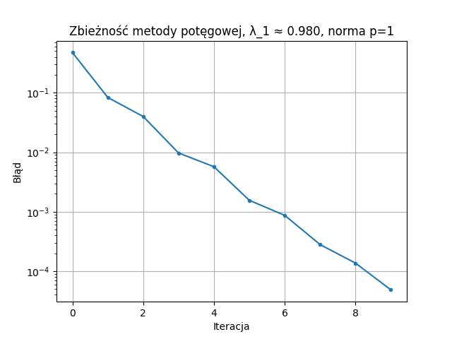

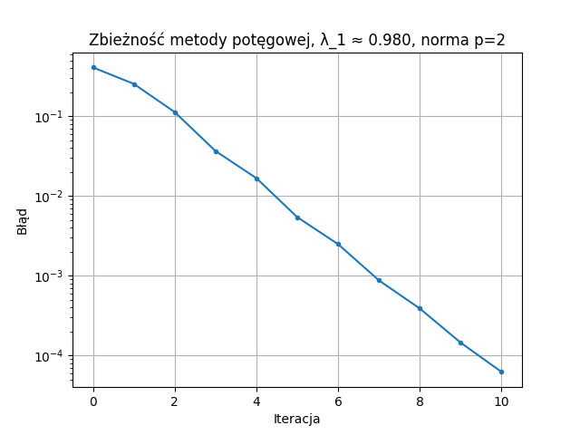

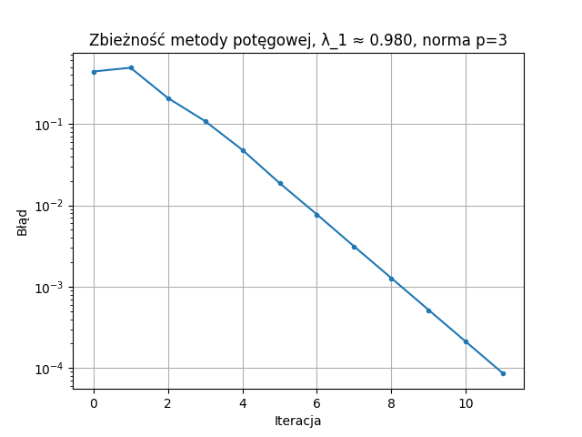

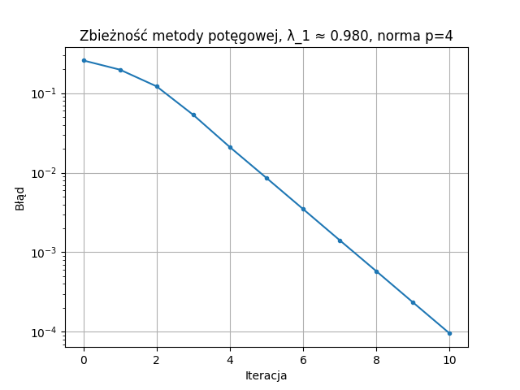

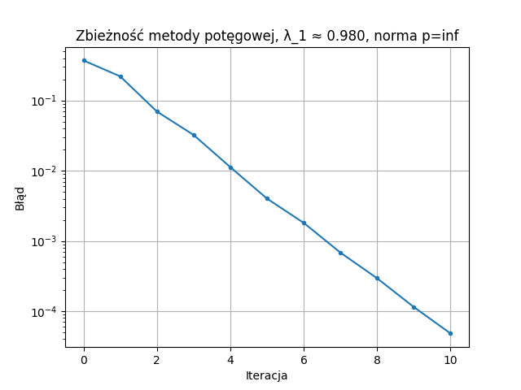


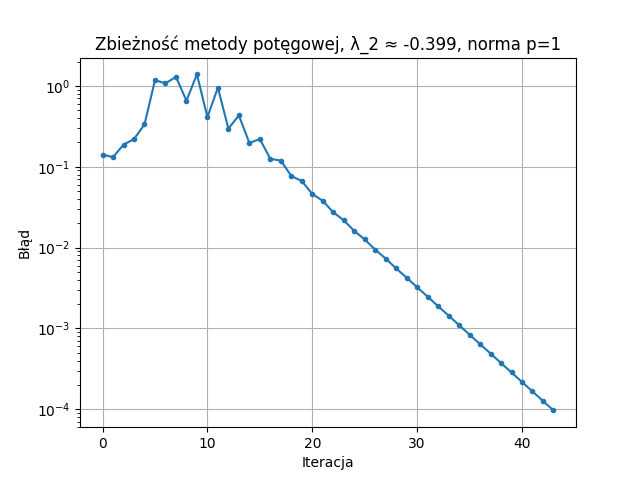

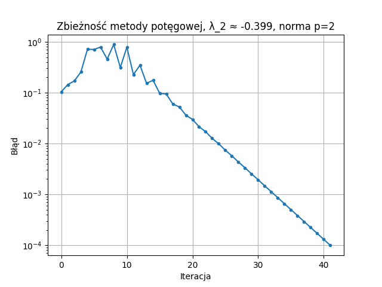

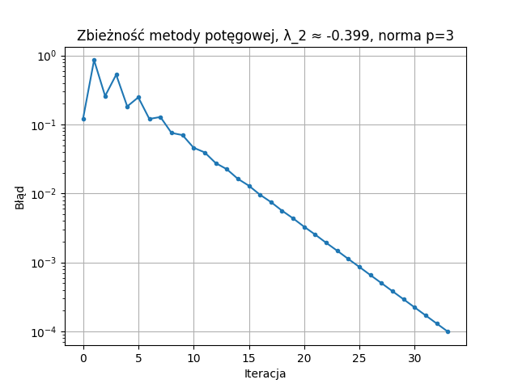

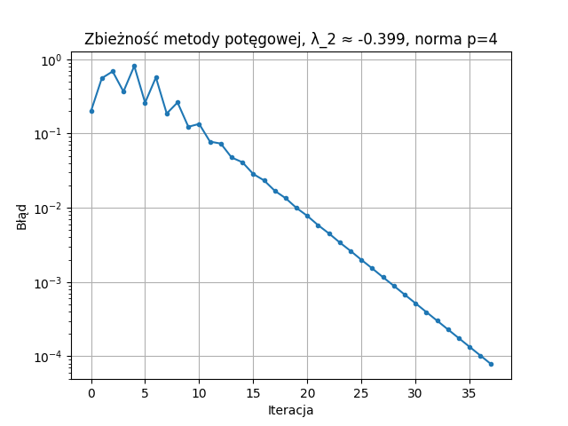

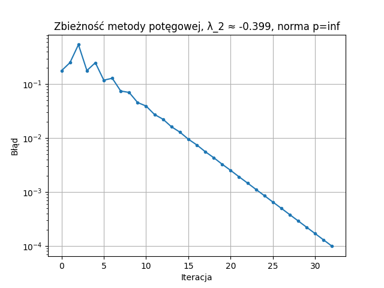


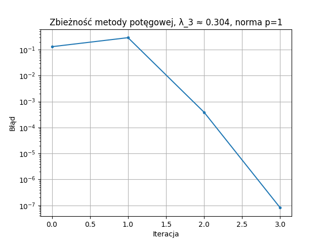

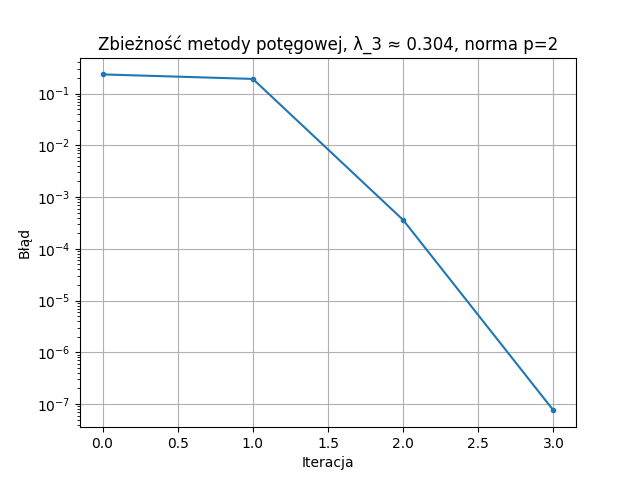

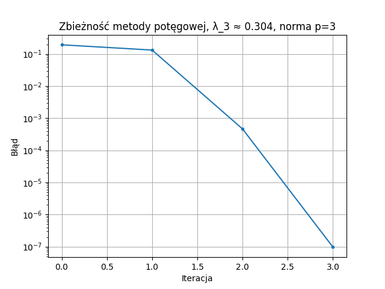

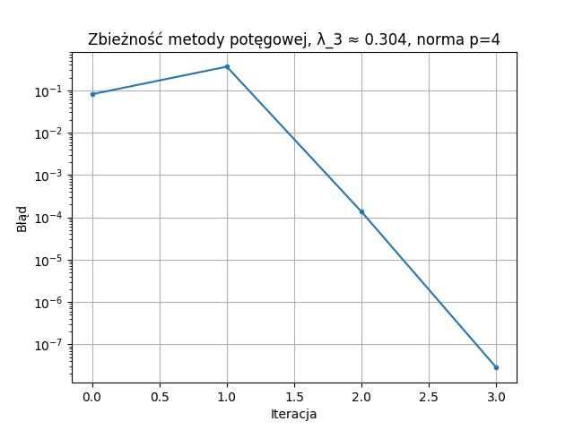

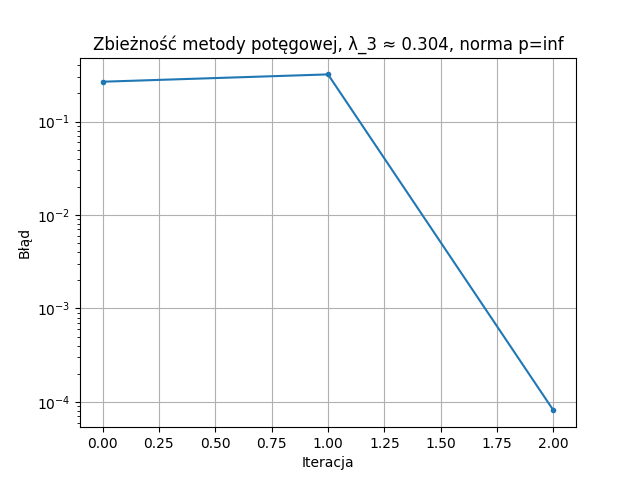


## Porównanie dokładności ‖UDV − SVD(A)‖ₚ

Porównano własny rozkład SVD z numpy.linalg.svd. Policzono błąd jako ‖UDV − SVD(A)‖ₚ

```text
p=1: 1.860e-15
p=2: 7.136e-16
p=3: 5.315e-16
p=4: 4.635e-16
p=inf: 3.608e-16
```
Błędy rzędu 1e-15  pokazują, że ręczne SVD działa tak samo dobrze jak biblioteczne.

## Wnioski 

- Własna implementacja SVD daje wynik praktycznie identyczny z numpy.linalg.svd
- Metoda potęgowa zbiega szybko dla największej wartości własnej. λ₁ ≈ 0.980 została znaleziona w 9–11 iteracjach
- Druga wartość własna λ₂ ≈ -0.399 zbiega  wolniej (30-43 iteracji)
- Trzecia wartość własna λ₃ ≈ 0.304 zbiega w 3-4 iteracjach do bardzo małego błędu (10⁻⁷)
